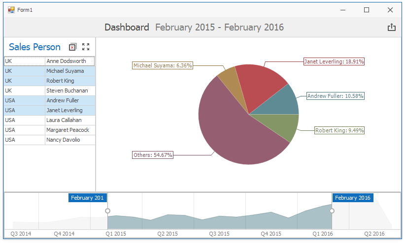

# Custom Visual Interactivity to Display the Others Slice in the Pie Chart

This example demonstrates the Pie Chart that displays slices for data rows selected in the Grid, while unselected data comprises the Others slice.

The dashboard is designed as follows:

* The [Grid](https://docs.devexpress.com/Dashboard/15150) does not act as master filter item.

* The [Pie Chart](https://docs.devexpress.com/Dashboard/15262) Argument data is bound to the [calculated field](https://docs.devexpress.com/Dashboard/16134) whose expression include [dashboard parameter](https://docs.devexpress.com/Dashboard/16135).

* The dashboard's hidden **ParamSalesPerson** parameter is a list of Sales Person names. 

* The calculated field **OthersChartSalesPerson** provides data for the chart's Argument and contains the following expression:
`Iif(?ParamSalesPerson Is Null, [Sales Person], Iif([Sales Person] In (?ParamSalesPerson), [Sales Person], 'Others'))`

When the [Dashboard Viewer](https://docs.devexpress.com/Dashboard/117122) loads the dashboard, [DashboardViewer.DashboardItemVisualInteractivity ](https://docs.devexpress.com/Dashboard/DevExpress.DashboardWin.DashboardViewer.DashboardItemVisualInteractivity) event occurs.The code in the event handler specifies the selection mode.

When a user selects a row in the Grid, the [DashboardViewer.DashboardItemSelectionChanged ](https://docs.devexpress.com/Dashboard/DevExpress.DashboardWin.DashboardViewer.DashboardItemVisualInteractivity) event occurs. The code in the event handler obtains filter values, assigns them to the dashboard parameters and stores the selection in the local variable.

> Another approach to perform the same task involves [Master Filtering](https://docs.devexpress.com/Dashboard/116912). Review the [How to Display the Others Slice in the Pie Chart](https://github.com/DevExpress-Examples/how-to-display-pie-chart-others-slice) example for more information.
